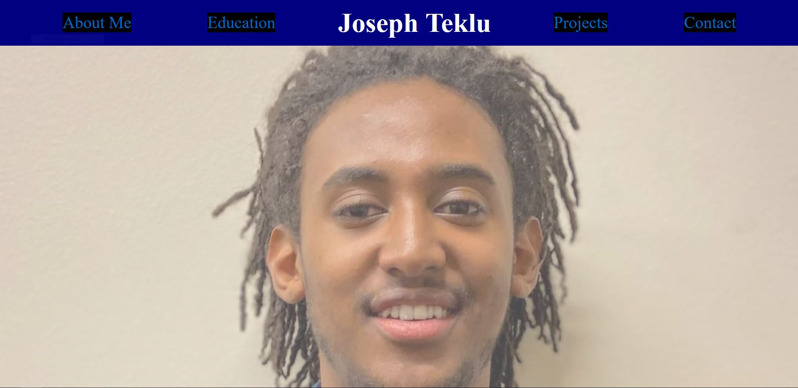

# Website-Portfolio

## This is a portfolio website I made. It include a lot of the things we learned in class like HTML/CSS media queries and css variables.

## Link to webpage: https://josephteklu.github.io/Website-Portfolio/

## Created by Joseph Teklu

## MIT License (check repo)
